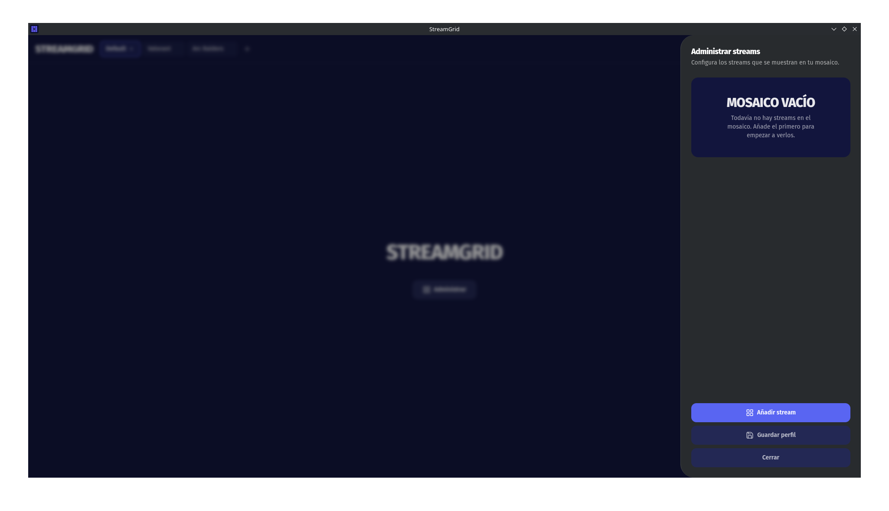
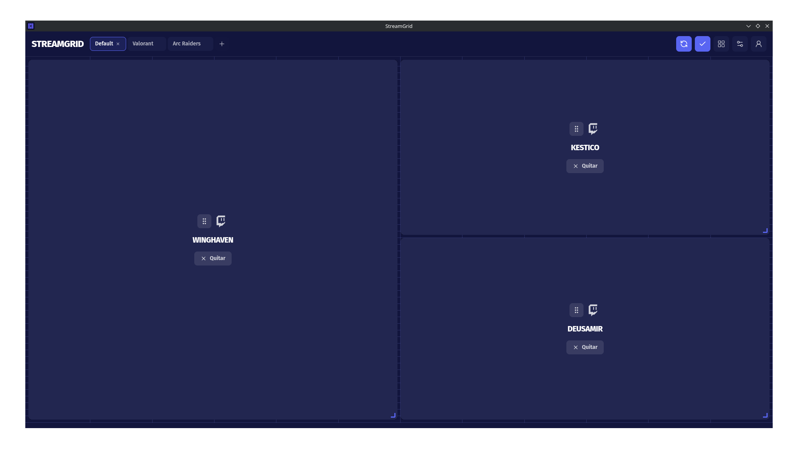
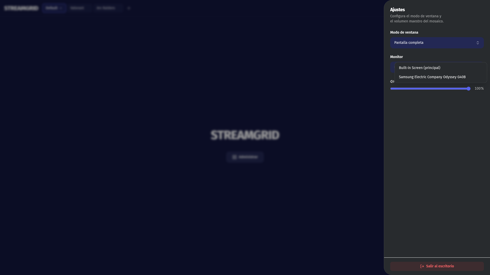

<!-- IMAGE: logo (docs/logo.png) -->

<div align="center">


# Stream Grid

A Twitch stream overlay built on Electron, React, and TypeScript.
_Un overlay de streams de Twitch construido con Electron, React y TypeScript._


</div>

---

## Downloads / Descargas

[](https://github.com/meiyerDev/streamgrid/releases/latest)

[📥 Descargar última versión para Windows](https://github.com/meiyerDev/streamgrid/releases/latest/download/StreamGrid-Setup.exe)  
[📥 Descargar última versión para Mac](https://github.com/meiyerDev/streamgrid/releases/latest/download/StreamGrid.dmg)  
[📥 Descargar última versión para Linux](https://github.com/meiyerDev/streamgrid/releases/latest/download/StreamGrid-x64.tar.gz)

**Linux (instalación local, sin root, sin FUSE):**

```bash
# tarball del release + updater del repo
curl -fsSL -o StreamGrid-x64.tar.gz \
  https://github.com/meiyerDev/streamgrid/releases/latest/download/StreamGrid-x64.tar.gz
curl -fsSL -o streamgrid-updater \
  https://raw.githubusercontent.com/meiyerDev/streamgrid/main/scripts/linux/streamgrid-updater
chmod +x streamgrid-updater
./streamgrid-updater install --file ./StreamGrid-x64.tar.gz
streamgrid
```

Instala en `~/.local/share/StreamGrid`, crea `~/.local/bin/streamgrid` y un `.desktop`. Las actualizaciones las aplica `~/.local/share/StreamGrid/updater`, invocado por la app al arrancar (estilo Discord).

También se publican AppImage y `.deb`. En arm64 usa `StreamGrid-arm64.tar.gz`.

**Actualizaciones automáticas:** al etiquetar un release (`vX.Y.Z`), la app instalada detecta la última versión en GitHub Releases. Windows/macOS usan `electron-updater`; Linux usa el updater externo anterior. En macOS se requiere firma/notarización para que la actualización automática funcione.

Para probar el flujo de actualización en desarrollo: `STREAMGRID_UPDATE_TEST=1 pnpm dev` (Win/mac usan `dev-app-update.yml`; Linux usa `scripts/linux/streamgrid-updater`).

---

## Screenshots / Capturas

<!-- IMAGE: dashboard (docs/screenshots/dashboard.png) -->



<!-- IMAGE: grid (docs/screenshots/grid.png) -->



<!-- IMAGE: fullscreen (docs/screenshots/fullscreen.png) -->



---

## Features / Características

- **Twitch stream grid** — add channels and place them on an interactive, draggable and resizable grid (_cuadrícula interactiva de streams de Twitch: agrega canales y rediseña su tamaño/posición_).
- **Multiple profiles** — save and switch between named layout profiles (_múltiples perfiles para guardar y alternar entre distintos layouts_).
- **Persistent sessions** — automatic Twitch login detection via browser cookies and the Helix API (_detección automática de la sesión de Twitch mediante cookies y la API Helix_).
- **Fullscreen preview** — push the grid to a chosen monitor in fullscreen (_vista previa fullscreen del grid en un monitor elegido_).
- **Master volume** — global mute/volume applied to every stream tile (_volumen maestro aplicado a todos los streams_).
- **Streaming-native UI** — Discord-style deep-indigo design language driven by `DESIGN.md` (_UI con estética de streaming, según el lenguaje de diseño en `DESIGN.md`_).
- **Auto-updates** — StreamGrid checks GitHub Releases on launch and installs the latest version automatically, with an in-app toast and install button (_actualizaciones automáticas vía GitHub Releases, con aviso y botón de reinicio en la app_).

---

## Quick Start

Requires **pnpm**. Install and run the dev server:

```bash
pnpm install
pnpm dev
```

---

## Usage / Uso

1. **Add a stream** — pick Twitch and enter a channel name. A live tile is added to the grid. (_Elige Twitch y escribe un canal: se agrega una casilla en vivo al grid._)
2. **Log in** — sign in to Twitch so the session is detected (_inicia sesión en Twitch para que la sesión se detecte_).
3. **Arrange the grid** — drag and resize each tile, or collapse to edit mode (_arrastra y redimensiona cada casilla, o ajusta el modo de edición_).
4. **Save a profile** — persist the layout under any name and switch profiles anytime (_guardá el layout bajo un nombre y cambiá de perfil cuando quieras_).
5. **Go fullscreen** — send the grid to a monitor in fullscreen and control the master volume (_manda el grid a un monitor a pantalla completa y controlá el volumen maestro_).

---

## Architecture / Arquitectura

Three independent Electron processes, each with its own bundle and `tsconfig`:

- `src/main/` — Electron **main process**: window lifecycle, IPC handlers, persistence, Twitch session detection.
- `src/preload/` — **preload bridge** exposed to the renderer as `window.electron` / `window.api`.
- `src/renderer/` — **React 19** app: routing (TanStack Router), editable grid (react-grid-layout), profile UI, settings.
- `src/shared/` — shared types and constants used by both main and renderer (streams, providers, views, settings).

The renderer never talks to Node directly — everything goes through typed IPC (`ipcRenderer.invoke`) wired in `src/preload/index.ts`.

---

## Project Structure / Estructura del proyecto

```
src/
├── main/         # main process (Node): index.ts, sessions.ts, stream-views.ts, profiles.ts, settings.ts
├── preload/      # preload bridge: index.ts, index.d.ts
├── renderer/
│   └── src/      # React app (alias @renderer/*)
│       ├── components/   # UI: add-stream-form, stream-tile, profile-tabs, settings-drawer, layouts, login-modal
│       ├── pages/        # home.tsx, account.tsx
│       ├── hooks/        # use-profiles, use-provider-sessions, use-settings
│       ├── providers/    # provider registry + session UI
│       ├── router.tsx    # TanStack Router with hash memory history
│       └── webview.ts    # WebView wrappers for each stream
└── shared/        # types shared across processes: providers.ts, streams.ts, views.ts, settings.ts
```

## Persistence / Persistencia

- **Profiles & streams** are stored as JSON in the app's `userData` directory (`profiles.json`).
- Legacy `streams.json` files are auto-migrated into a default profile on first launch.
- Twitch sessions are detected from the persisted cookies of the named partition (`auth-token` / `auth-user`), then the Helix API confirms the user and avatar.

## Scripts / Commands

| Command             | Description                                            |
| ------------------- | ------------------------------------------------------ |
| `pnpm dev`          | Start Electron with hot module reload (dev + HMR)      |
| `pnpm lint`         | ESLint (cached)                                        |
| `pnpm format`       | Prettier (write)                                       |
| `pnpm typecheck`    | TypeScript check for **both** node + web configs       |
| `pnpm build`        | Typecheck then electron-vite build (outputs to `out/`) |
| `pnpm build:unpack` | Build + unpacked dir (`electron-builder --dir`)        |
| `pnpm build:win`    | Build + Windows installer                              |
| `pnpm build:mac`    | Build + macOS package                                  |
| `pnpm build:linux`  | Build + Linux package (tar.gz / AppImage / deb)        |

---

## License / Licencia

See the [LICENSE](LICENSE) file. _Consultá el archivo `LICENSE`._
